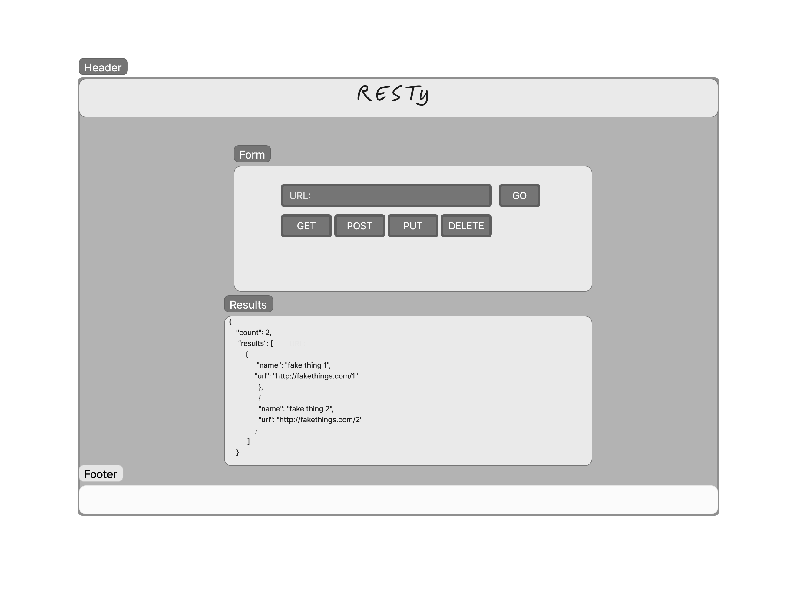

# LAB - Component Based UI

## Authors: Jeremy Cleland

## Problem Domain

### Phase 1 Requirements

- Today, we begin the first of a 4-Phase build of the RESTy application, written in React. In this first phase, our goal is to setup the basic scaffolding of the application, with intent being to add more functionality to the system as we go. This initial build sets up the file structure so that we can progressively build this application in a scalable manner.

- #### Phase 1: Application Setup

  - Scaffolding
  - Basic React Application
  - Basic State
  - Rendering

- ##### [Netlify-deployment](cleland-resty.netlify.app)

### Phase 2 Requirements

- App

  - Holds application state: The Request (from the form) and the Response (from the API).
  - Hook that can update state.
  - Renders 2 Child Components.

- Form:
  - Expects a function to be sent to it as a prop.
  - Renders a URL entry form.
  - A selection of REST methods to choose from (“get” should be the default).
    - The active selection should be displayed/styled differently than the others.
  - Renders a Textarea to allow the user to type in a JSON object for a POST or PUT request.
  - On submit:
    - Send the Form entries back to the `<App />` using the method sent down in props.
    - Form will run the API request.
      - Toggle the “loading” status before and after the request.

- Results:
  - Conditionally renders “Loading” or the data depending on the status of the request.
  - Expects the count, headers, results to be sent in as props.
  - Renders the count.
  - Renders the Result Headers as “pretty” JSON.
  - Renders the Result Body as “pretty” JSON.

- #### Phase 2: Testing and Deployment

  - Testing of React components and applications
  - Uses best practices for testing Behaviors and Acceptance Criteria
  - Integrates with an online CI framework
  - Deploy to GitHub Pages, Netlify, and/or AWS

### Phase 3 Requirements

Extend your application to include the ability to send http requests and display response data, when the <Form /> component experiences a submission event.

- Refactor application methods to allow for browser side HTTP requests to be sent.
  - Your implementation should allow the user to set a url, method, and request body.
- Make sure all relevant request and response data is displayed to the User.

#### Approach

- `<Form />`: component, onSubmit() sends the user’s entries to the <App /> via method sent in through props.

- `<App />`: does a check on the request data from the form and updates the request variable in state with the url, method, and potentially the body.

- `<App />`: has an effect hook that’s looking for changes to the request variable in state, and in response, runs the API request with the new request options from state.

- `<App />`: updates state with the results of the API Request.

- `<Results />`: sees the new API data as a prop and renders the JSON.

- #### Phase 3: State and Props

  - Create multiple components to handle each aspect of the Application
  - Sharing state and behaviors between components
  - Basic layout and styling

### Phase 4 Requirements

- #### Phase 4: Fit and Finish

  - Incorporate the spinner, using conditional rendering
  - App is Fully Tested
  - App is Fully Documented
  - RESTy is Deployed and publicly available

### How to initialize/run your application (where applicable)

- `npm start`
- `nodemon`
- `node hub.js`
- `node index.js`

### Features / Routes

- GET
- POST
- PUT
- Delete

### Links and Resources

### UML

